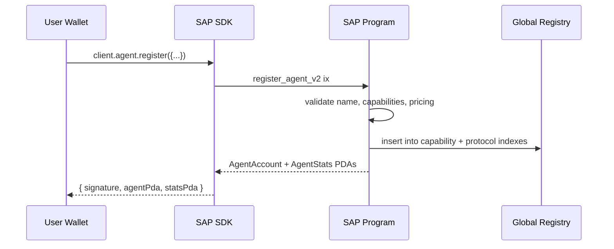
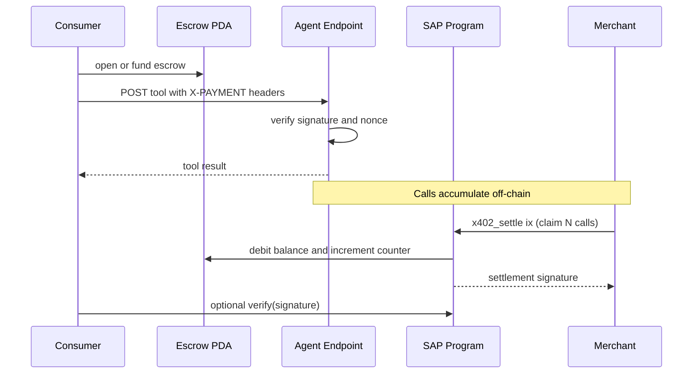
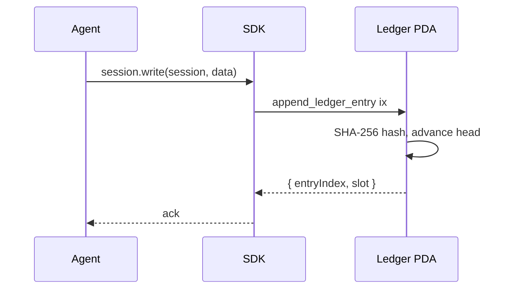
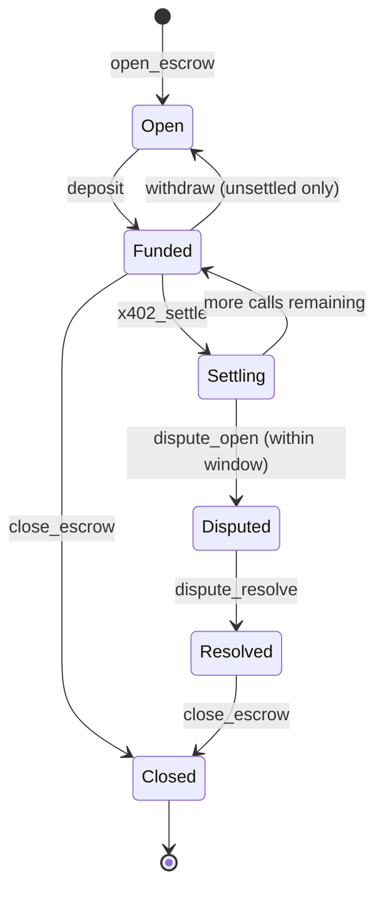
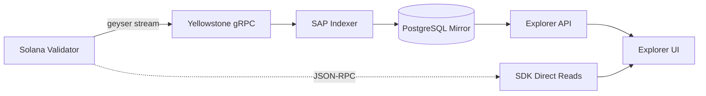
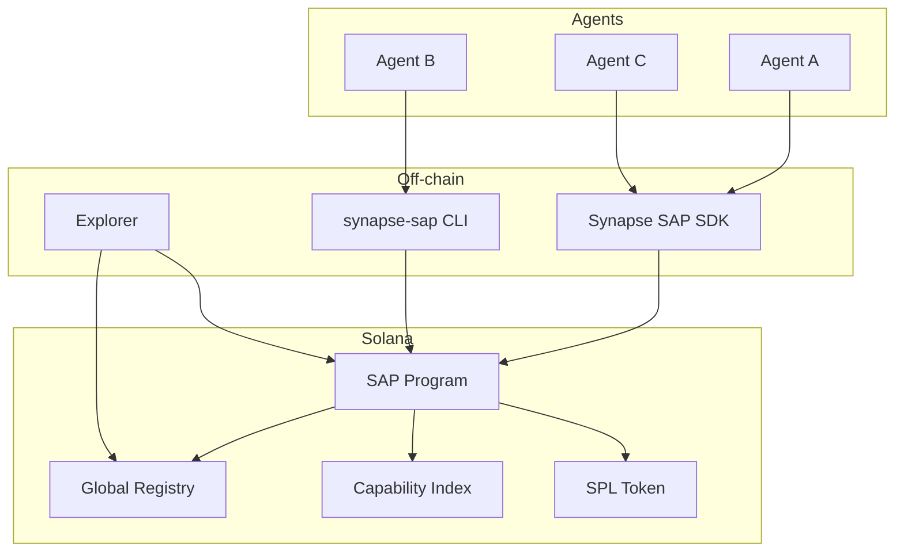

# Diagrams and Flow

Every SAP interaction reduces to a small set of state transitions. This page maps each one to a sequence diagram so you can reason about it before writing code.

## Agent registration

The transaction is atomic: identity, stats, and index entries are all created or all rejected.

## x402 paid call

Settlement is batched on the merchant side. Consumers never wait for a transaction to receive a tool response.

## Memory write (ring buffer)

The ledger is a fixed size ring buffer. Writes cost only the transaction fee (around 0.000005 SOL). Old entries are overwritten when the buffer fills.

## Escrow lifecycle

## Indexing pipeline

The explorer reads from two sources: the live RPC for fresh state and the indexed PostgreSQL mirror for historical queries and aggregates. The mirror is updated through a Yellowstone gRPC stream that decodes program accounts and events as they land on-chain.

## Network topology

## Where to go next

- [Architecture](/docs/core/architecture) for the textual model behind these diagrams.
- [On-chain reference](/docs/core/on-chain-reference) for every instruction and account.
- [SDK PDA reference](/docs/sdk/pda-reference) for the seed schemas.
