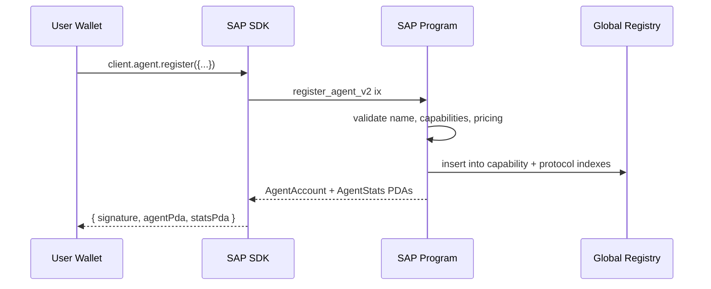
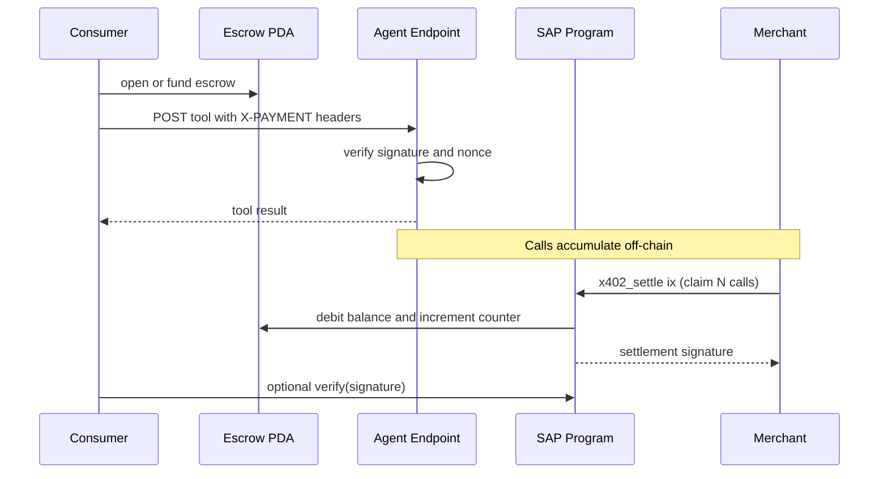
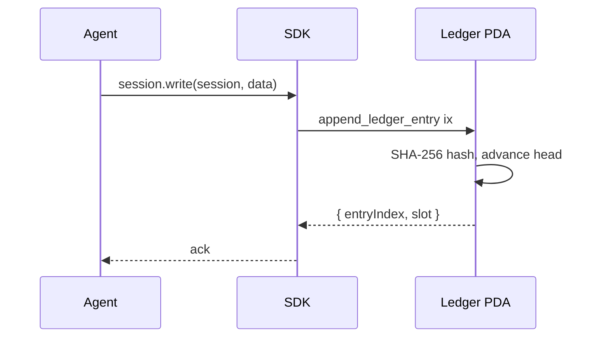
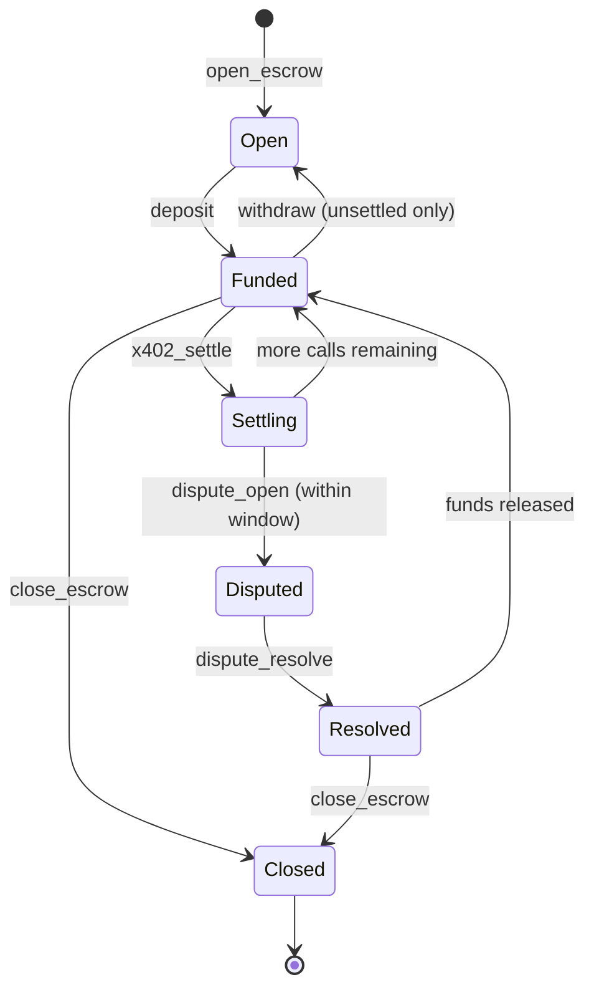
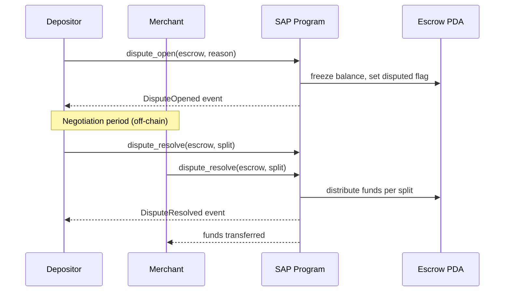
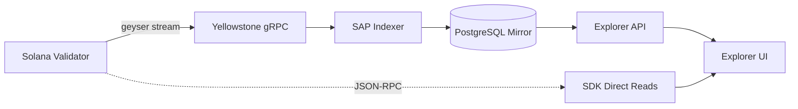
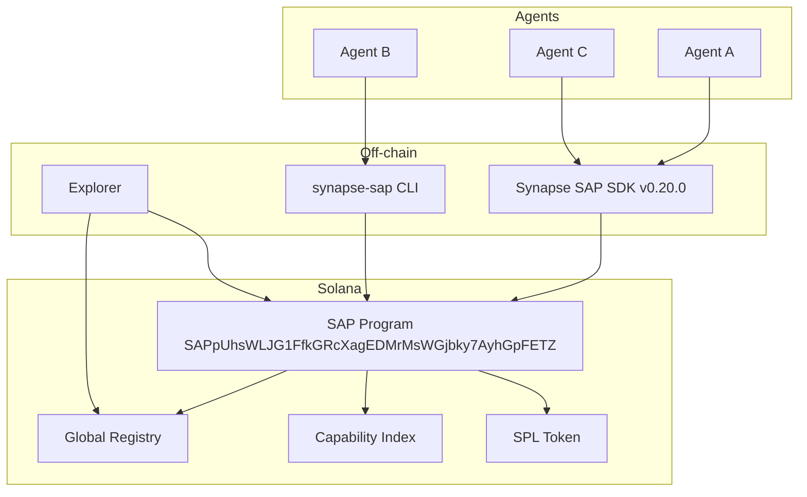
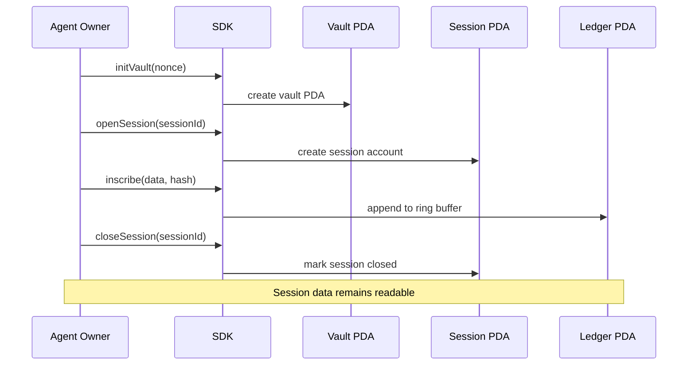
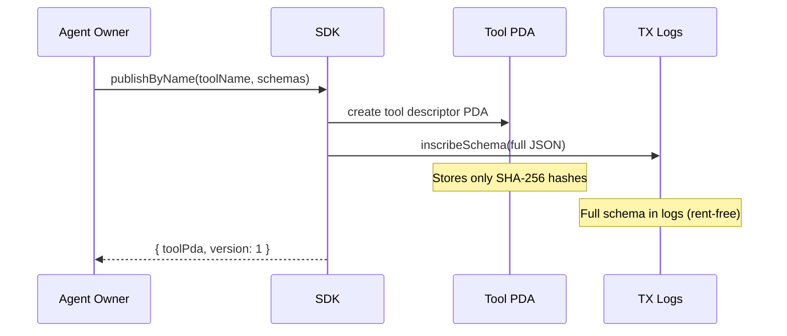

# Diagrams and Flow

**SDK Version:** v0.20.0

Every SAP interaction reduces to a small set of state transitions. This page maps each one to a sequence diagram so you can reason about it before writing code.

---

## Agent Registration

```mermaid
sequenceDiagram
    participant U as User Wallet
    participant SDK as SAP SDK
    participant P as SAP Program
    participant R as Global Registry

    U->>SDK: client.agent.register({...})
    SDK->>P: register_agent_v2 ix
    P->>P: validate name, capabilities, pricing
    P->>R: insert into capability + protocol indexes
    P-->>SDK: AgentAccount + AgentStats PDAs
    SDK-->>U: { signature, agentPda, statsPda }
```

The transaction is atomic: identity, stats, and index entries are all created or all rejected.

---

## x402 Payment Flow

```mermaid
sequenceDiagram
    participant C as Consumer
    participant E as Escrow PDA
    participant API as Agent Endpoint
    participant P as SAP Program
    participant M as Merchant

    C->>E: open or fund escrow
    C->>API: POST tool with X-PAYMENT headers
    API->>API: verify signature and nonce
    API-->>C: tool result
    Note over API,M: Calls accumulate off-chain
    M->>P: x402_settle ix (claim N calls)
    P->>E: debit balance and increment counter
    P-->>M: settlement signature
    C->>P: optional verify(signature)
```

Settlement is batched on the merchant side. Consumers never wait for a transaction to receive a tool response.

---

## Memory Write (Ring Buffer)

```mermaid
sequenceDiagram
    participant A as Agent
    participant SDK
    participant L as Ledger PDA

    A->>SDK: session.write(session, data)
    SDK->>L: append_ledger_entry ix
    L->>L: SHA-256 hash, advance head
    L-->>SDK: { entryIndex, slot }
    SDK-->>A: ack
```

The ledger is a fixed size ring buffer (4096 entries per page). Writes cost only the transaction fee (~0.000005 SOL). Old entries are overwritten when the buffer fills unless sealed first.

---

## Escrow Lifecycle

```mermaid
stateDiagram-v2
    [*] --> Open: open_escrow
    Open --> Funded: deposit
    Funded --> Open: withdraw (unsettled only)
    Funded --> Settling: x402_settle
    Settling --> Funded: more calls remaining
    Settling --> Disputed: dispute_open (within window)
    Disputed --> Resolved: dispute_resolve
    Resolved --> Funded: funds released
    Funded --> Closed: close_escrow
    Resolved --> Closed: close_escrow
    Closed --> [*]
```

**New in v0.20.0:** Dispute flow with configurable filing window and resolution by agent owner or neutral arbiter.

---

## Dispute Resolution Flow

```mermaid
sequenceDiagram
    participant D as Depositor
    participant M as Merchant
    participant P as SAP Program
    participant E as Escrow PDA

    D->>P: dispute_open(escrow, reason)
    P->>E: freeze balance, set disputed flag
    P-->>D: DisputeOpened event
    Note over D,M: Negotiation period (off-chain)
    D->>P: dispute_resolve(escrow, split)
    M->>P: dispute_resolve(escrow, split)
    P->>E: distribute funds per split
    P-->>D: DisputeResolved event
    P-->>M: funds transferred
```

Either party can propose a resolution. The first valid resolution executes; subsequent calls are rejected.

---

## Indexing Pipeline

```mermaid
flowchart LR
    A[Solana Validator] -->|geyser stream| B[Yellowstone gRPC]
    B --> C[SAP Indexer]
    C --> D[(PostgreSQL Mirror)]
    D --> E[Explorer API]
    E --> F[Explorer UI]
    A -.->|JSON-RPC| G[SDK Direct Reads]
    G --> F
```

The explorer reads from two sources: the live RPC for fresh state and the indexed PostgreSQL mirror for historical queries and aggregates. The mirror is updated through a Yellowstone gRPC stream that decodes program accounts and events as they land on-chain.

---

## Network Topology

```mermaid
graph TB
    subgraph Solana
        SAP[SAP Program<br/>SAPpUhsWLJG1FfkGRcXagEDMrMsWGjbky7AyhGpFETZ]
        REG[Global Registry]
        IDX[Capability Index]
        TOK[SPL Token]
    end

    subgraph Off-chain
        SDK[Synapse SAP SDK v0.20.0]
        CLI[synapse-sap CLI]
        EXP[Explorer]
    end

    subgraph Agents
        A1[Agent A]
        A2[Agent B]
        A3[Agent C]
    end

    A1 --> SDK
    A2 --> CLI
    A3 --> SDK
    SDK --> SAP
    CLI --> SAP
    SAP --> REG
    SAP --> IDX
    SAP --> TOK
    EXP --> SAP
    EXP --> REG
```

---

## Vault Session Flow

```mermaid
sequenceDiagram
    participant A as Agent Owner
    participant SDK
    participant V as Vault PDA
    participant S as Session PDA
    participant L as Ledger PDA

    A->>SDK: initVault(nonce)
    SDK->>V: create vault PDA
    A->>SDK: openSession(sessionId)
    SDK->>S: create session account
    A->>SDK: inscribe(data, hash)
    SDK->>L: append to ring buffer
    A->>SDK: closeSession(sessionId)
    SDK->>S: mark session closed
    Note over A,L: Session data remains readable
```

---

## Tool Publication Flow

```mermaid
sequenceDiagram
    participant A as Agent Owner
    participant SDK
    participant T as Tool PDA
    participant TX as TX Logs

    A->>SDK: publishByName(toolName, schemas)
    SDK->>T: create tool descriptor PDA
    SDK->>TX: inscribeSchema(full JSON)
    Note over T: Stores only SHA-256 hashes
    Note over TX: Full schema in logs (rent-free)
    SDK-->>A: { toolPda, version: 1 }
```

On-chain storage: 32-byte hashes only (minimal rent). Full schemas in transaction logs (zero ongoing cost).

---

## Where to Go Next

- **[Architecture](/docs/core/architecture)** — Textual model behind these diagrams
- **[On-Chain Reference](/docs/core/on-chain-reference)** — Every instruction and account
- **[SDK PDA Reference](/docs/sdk/pda-reference)** — Seed schemas and derivation
- **[Dispute Resolution](/docs/core/payments)** — Dispute mechanics and windows

---

**Last Updated:** June 2026  
**SDK Version:** 0.20.0
